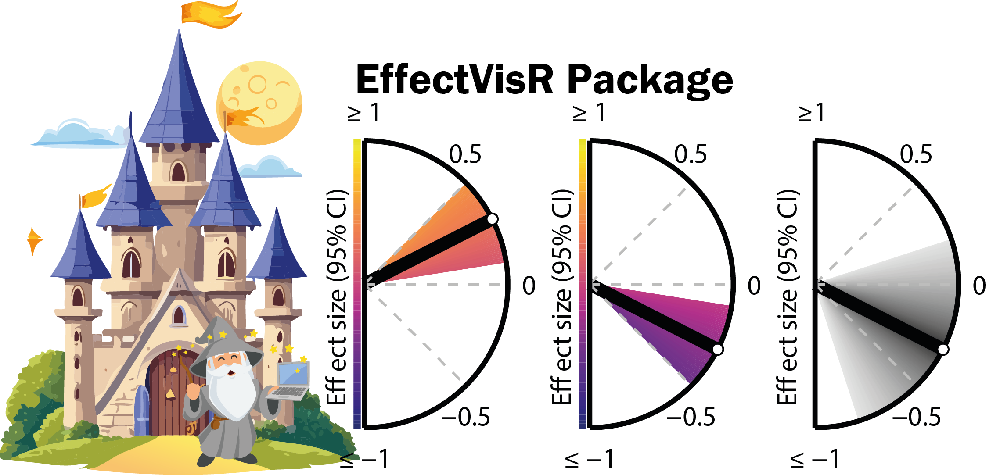

<!-- README.md is generated from README.Rmd. Please edit that file -->

```{r, include = FALSE}
knitr::opts_chunk$set(
  collapse = TRUE,
  comment = "#>",
  fig.path = "man/figures/README-",
  out.width = "100%"
)
```


[](https://doi.org/10.5281/zenodo.14544022)  

# EffectVisR

# Overview

The **EffectVisR** package provides functions to easily visualise effect sizes and their 95% confidence intervals. It offers two flexible plotting functions, each tailored to highlight confidence intervals in different ways:

-   `es_plot_v1`: Highlights confidence intervals with distinct gradient colours.
-   `es_plot_v2`: Emphasises the closeness of confidence intervals to the effect size using gradient shading.

Both functions are highly customisable and are ideal for presentations and publications.



### Key Features:

-   **Two visualisation methods**:

    -   `es_plot_v1`: Shades the confidence interval with different colours for the lower and upper bounds.

    -   `es_plot_v2`: Shades the confidence interval with lighter colours further from the effect size.

<!-- -->

-   **Customisable visuals**:

    -   Multiple colour palettes (`"viridis"`, `"grey"`, `"magma"`, etc.).

    -   Adjustable axis labels, titles, and arrow styles.

    -   Option to display the confidence interval as a full fan or partial arc.

-   **Export options**: Save plots as high-quality PNG files with transparent backgrounds.

## Installation

To install the latest version of **EffectVisR** from GitHub, use the following commands in R:

`install.packages("remotes")`

`remotes::install_github("FSchwendinger/EffectVisR")`

After installation, load the package using:

```{r load_package, message = FALSE, warning = FALSE, echo = TRUE, eval = F}
library(EffectVisR)
```

## Example Usage

### 1. Visualising effect sizes with `es_plot_v1`

The `es_plot_v1` function creates a plot with a gradient showing confidence intervals around an effect size. It highlights the range of possible effect sizes (95% CI) using colour gradients, with different colours for positive and negative effect sizes.

```{r, message = FALSE, warning = FALSE, echo = TRUE, eval = T, out.width = "50%"}
library(EffectVisR)

# Define the effect size and confidence intervals
effect_size <- 0.4
ci_lower <- 0.1
ci_upper <- 0.7

# Create the plot
EffectVisR::es_plot_v1(
  effect_size = effect_size,
  ci_lower = ci_lower,
  ci_upper = ci_upper,
  palette = "viridis",
  arrow_color = "black",
  axis_title_size = 8,
  axis_label_size = 8
)
```

### 2. Visualising effect sizes with `es_plot_v2`

The `es_plot_v2` function generates a plot with shading that highlights the confidence interval range and how close it is to the effect size. Darker colours within the 95% CI show that the values are close to the estimate, while lighter colours are further away.This will produce plots like the following.

```{r, message = FALSE, warning = FALSE, echo = TRUE, eval = T, out.width = "50%"}
# Define effect size and confidence interval
effect_size <- -0.3
ci_lower <- -0.6
ci_upper <- 0

# Create plot 1
a = EffectVisR::es_plot_v2(
  effect_size = effect_size,
  ci_lower = ci_lower,
  ci_upper = ci_upper,
  palette = "grey",
  arrow_color = "darkred",
  axis_title_size = 8,
  axis_label_size = 8
)

# Create plot 2
b = EffectVisR::es_plot_v2(
  effect_size = effect_size,
  ci_lower = ci_lower,
  ci_upper = ci_upper,
  palette = "magma",
  axis_title_size = 8,
  axis_label_size = 8,
  area_arc = 0.95
)

cowplot::plot_grid(a, b, nrow = 1)
```

## Customisation Options

Both functions (`es_plot_v1` and `es_plot_v2`) allow you to adjust several parameters:

-   **effect_size**: Numeric value indicating the estimated effect size.

-   **ci_lower, ci_upper**: Lower and upper bounds of the 95% confidence interval.

-   **palette**: Choose from `"viridis"`, `"grey"`, or other Viridis-based palettes (e.g., `"magma"`, `"plasma"`, etc.).

-   **arrow_color**: Customise the colour of the arrow representing the effect size.

-   **area_arc**: Switch between fan and arch to display 95% confidence intervals.

-   **save_path**: Option to save the plot as a PNG file (optional).

-   **axis_title_size, axis_label_size**: Adjust font sizes for axis titles and labels.

-   **limit**: Set the limits of effect sizes displayed in the plot.

### Example: Saving the Plot

You can save your plot with a transparent background using the `save_path` argument.

```{r, message = FALSE, warning = FALSE, echo = TRUE, eval = F}
EffectVisR::es_plot_v1(
  effect_size = 0.4,
  ci_lower = 0.1,
  ci_upper = 0.7,
  palette = "viridis",
  arrow_color = "black",
  save_path = "effect_size_plot.png"
)
```

## License 

This package is licensed under the Creative Commons Attribution-NonCommercial 4.0 International (CC BY-NC 4.0) License. You are free to use, share, and modify the work for non-commercial purposes, provided that appropriate credit is given. See the [LICENSE](LICENSE-CC-BY-NC-4.0.md) file for more information.

For more details, see [Creative Commons BY-NC 4.0](https://creativecommons.org/licenses/by-nc/4.0/).

## Citation

If you use this R-package, please cite it as follows:

Schwendinger, F., & Lichtenstein, E. (2024). EffectVisR - Customisable effect size plots with confidence intervals for scientific presentations and publications (v1.0.0). Zenodo. https://doi.org/10.5281/zenodo.14544022

## Contributors

-   **Fabian Schwendinger, PhD** *(author, creator)* [](https://www.linkedin.com/in/fabian-schwendinger)

-   **Eric Lichtenstein, PhD** *(author)*

-   **Denis Infanger, PhD** *(contributor)*

Feel free to contribute or report any issues on the [GitHub](https://github.com/FSchwendinger/EffectVisR) repository.
