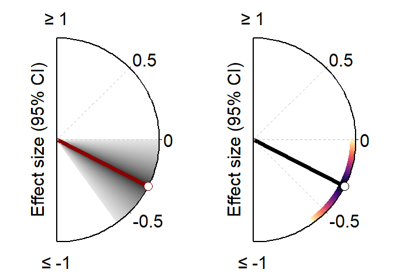

<!-- README.md is generated from README.Rmd. Please edit that file -->

# effect.size.wiz

# Overview

The **effect.size.wiz** package provides functions to easily visualise
effect sizes and their 95% confidence intervals. It includes
customisable options for colour palettes, axis labels, and saving the
plot with a transparent background. The visualisations generated by this
package are ideal for presentations and publications where a clear
depiction of effect sizes is essential.

### Key Features:

- Visualise effect sizes with confidence intervals using a colour-coded
  gradient.

- Customisable options for colour palettes (“viridis”, “grey”, etc.),
  font sizes, and arrow styles.

- Options for saving the plot with a transparent background.

## Installation

To install the latest version of **effect.size.wiz** from GitHub, use
the following commands in R:

`install.packages("remotes")`

`remotes::install_github("FSchwendinger/effect.size.wiz")`

After installation, load the package using:

``` r
library(effect.size.wiz)
```

## Example Usage

### 1. Using `es_plot_v1`

The `es_plot_v1` function creates a plot with a gradient showing
confidence intervals around an effect size. It highlights the range of
possible effect sizes (95% CI) using colour gradients, with different
colours for positive and negative effect sizes.

``` r
library(effect.size.wiz)

# Define the effect size and confidence intervals
effect_size <- 0.4
ci_lower <- 0.1
ci_upper <- 0.7

# Create the plot
effect.size.wiz::es_plot_v1(
  effect_size = effect_size,
  ci_lower = ci_lower,
  ci_upper = ci_upper,
  palette = "viridis",
  arrow_color = "black"
)
#> Warning in ggplot2::annotate("text", x = cos(pi/2), y =
#> sin(pi/2), label = "≥ 1", : Ignoring unknown parameters:
#> `linewidth`
```


This will produce a plot like the following.

<figure>

<figcaption aria-hidden="true">Effect Size Plot Example 1</figcaption>
</figure>

### 2. Using `es_plot_v2`

The `es_plot_v2` function generates a plot with shading that highlights
the confidence interval range and how close it is to the effect size.
Darker colours within the 95% CI show that the values are close to the
estimate, while lighter colours are further away.

``` r
# Define effect size and confidence intervals
effect_size <- -0.3
ci_lower <- -0.6
ci_upper <- -0.1

# Create the plot
effect.size.wiz::es_plot_v2(
  effect_size = effect_size,
  ci_lower = ci_lower,
  ci_upper = ci_upper,
  palette = "grey",
  arrow_color = "darkred"
)
```



This will produce a plot like the following.

<figure>

<figcaption aria-hidden="true">Effect Size Plot Example 2</figcaption>
</figure>

## Customisation Options

Both functions (`es_plot_v1` and `es_plot_v2`) allow you to adjust
several parameters:

- **effect_size**: Numeric value indicating the estimated effect size.

- **ci_lower, ci_upper**: Lower and upper bounds of the 95% confidence
  interval.

- **palette**: Choose from `"viridis"`, `"grey"`, or other Viridis-based
  palettes (e.g., `"magma"`, `"plasma"`, etc.).

- **arrow_color**: Customise the colour of the arrow representing the
  effect size.

- **save_path**: Option to save the plot as a PNG file (optional).

- **axis_title_size, axis_label_size**: Adjust font sizes for axis
  titles and labels.

### Example: Saving the Plot

You can save your plot with a transparent background using the
`save_path` argument.

``` r
effect.size.wiz::es_plot_v1(
  effect_size = 0.4,
  ci_lower = 0.1,
  ci_upper = 0.7,
  palette = "viridis",
  arrow_color = "black",
  save_path = "effect_size_plot.png"
)
#> Warning in ggplot2::annotate("text", x = cos(pi/2), y =
#> sin(pi/2), label = "≥ 1", : Ignoring unknown parameters:
#> `linewidth`
```


## License

This package is licensed under the LGPL-3.0. See the [LICENSE](LICENSE)
file for more information.

## Contributors

- Fabian Schwendinger (author, creator)

- Eric Lichtenstein (author)

Feel free to contribute or report any issues on
[GitHub](https://github.com/FSchwendinger/effect.size.wiz).
